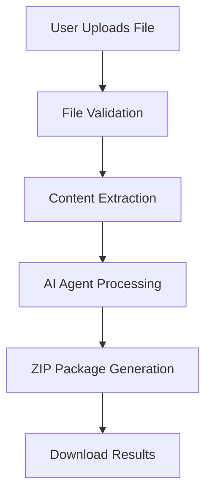

# Digital Superman - Complete Architecture & Flow Explanation

## 🏗️ **Project Overview**

Digital Superman is a Flask-based web application that transforms Azure architecture diagrams into production-ready infrastructure code using AI agents. It converts various file formats (PNG, JPG, PDF, XML, Draw.io, VSDX, SVG) into Bicep templates, Azure DevOps pipelines, and deployment scripts.

## 🎯 **Core Concept**

The application follows a **multi-agent AI architecture** where each agent specializes in a specific task:
- **Architecture Analyzer**: Understands what's in your diagram
- **Policy Checker**: Ensures compliance with Azure best practices
- **Cost Optimizer**: Calculates costs and suggests optimizations
- **Bicep Generator**: Creates infrastructure code

## 🔧 **Python Flask Application Architecture**

### **1. Main Application (app.py)**

```python
# Core Components:
- Flask web server with Bootstrap UI
- ThreadPoolExecutor for parallel processing
- Singleton pattern for agent instances
- Performance monitoring and caching
- File upload handling and validation
```

**Key Features:**
- **Lazy Loading**: Agents are created only when needed
- **Singleton Pattern**: One instance per agent type for efficiency
- **Parallel Processing**: Multiple agents run simultaneously
- **Caching**: Results are cached to avoid reprocessing
- **Performance Monitoring**: Tracks execution time and memory usage

### **2. Configuration (config.py)**

```python
# Environment Management:
- Azure AI Foundry endpoints
- OpenAI API keys
- File upload settings
- Environment-specific configurations (dev/staging/prod)
```

### **3. File Processing Flow**



## 🤖 **AI Agents Architecture**

### **Agent 1: Architecture Analyzer**
**Location**: `agents/architecture_analyzer.py`

**Purpose**: Analyzes uploaded architecture diagrams and extracts Azure components

**How it works:**
1. **Content Processing**: Receives extracted content from file processor
2. **AI Analysis**: Uses GPT-4 to identify Azure services and relationships
3. **Component Extraction**: Creates structured data about:
   - Azure services (App Service, SQL Database, Storage, etc.)
   - Network topology and connections
   - Configuration details
   - Dependencies and relationships

**Output Structure:**
```json
{
  "components": [
    {
      "name": "App Service",
      "type": "app service",
      "properties": {...}
    }
  ],
  "relationships": [...],
  "network_topology": {...},
  "summary": "Architecture description"
}
```

### **Agent 2: Policy Checker**
**Location**: `agents/policy_checker.py`

**Purpose**: Validates architecture against Azure policies and compliance requirements

**How it works:**
1. **Policy Loading**: Loads 40+ predefined Azure policies from JSON files
2. **Compliance Check**: Validates architecture against:
   - Security policies (NSG rules, encryption, etc.)
   - Governance policies (naming conventions, resource groups)
   - Cost optimization policies
   - Best practices
3. **Auto-Fix**: Automatically fixes common violations when possible
4. **Environment-Specific**: Different rules for dev/staging/production

**Output Structure:**
```json
{
  "compliant": true/false,
  "violations": [...],
  "fixes_applied": [...],
  "policy_score": 85,
  "recommendations": [...]
}
```

### **Agent 3: Cost Optimizer**
**Location**: `agents/cost_optimization_agent.py`

**Purpose**: Calculates costs and provides optimization recommendations

**How it works:**
1. **Cost Calculation**: Uses Azure pricing data to estimate monthly costs
2. **Environment Adjustments**: Different pricing for dev/staging/prod
3. **Optimization Analysis**: Suggests:
   - Resource right-sizing
   - Reserved instances
   - Auto-scaling configurations
   - Cost-saving alternatives
4. **Savings Estimation**: Calculates potential monthly/annual savings

**Output Structure:**
```json
{
  "optimization_summary": {
    "estimated_monthly_savings": "€150-600",
    "total_recommendations": 8,
    "implementation_priority": "Medium"
  },
  "optimization_recommendations": [...],
  "cost_savings": [...]
}
```

### **Agent 4: Bicep Generator**
**Location**: `agents/bicep_generator.py`

**Purpose**: Creates production-ready Bicep templates and Azure DevOps pipelines

**How it works:**
1. **Template Generation**: Creates modular Bicep templates for each Azure service
2. **Parameter Files**: Generates environment-specific parameter files
3. **Pipeline Creation**: Creates Azure DevOps YAML pipelines for CI/CD
4. **Documentation**: Generates deployment guides and scripts

**Output Structure:**
```
Generated Files:
- main.bicep (main template)
- modules/*.bicep (service-specific modules)
- parameters/dev.parameters.json
- pipelines/azure-pipelines.yml
- deploy.ps1 (deployment script)
```

## 🔄 **Complete Processing Flow**

### **Step 1: File Upload & Validation**
```python
# In app.py upload_file() function:
1. User uploads file via web interface
2. File type validation (PNG, JPG, PDF, XML, etc.)
3. File size validation
4. Secure filename generation
5. File saved to uploads/ directory
```

### **Step 2: Content Extraction**
```python
# In utils/file_processor.py:
1. Detect file type
2. Extract content using appropriate method:
   - Images: OCR text extraction
   - PDF: Text and image extraction
   - XML/Draw.io: Parse XML structure
   - VSDX: Extract from Office format
```

### **Step 3: Parallel AI Processing**
```python
# In app.py process_architecture_diagram_async():
1. Architecture Analysis (Agent 1)
2. Policy Compliance Check (Agent 2) - runs in parallel
3. Auto-fix policy violations if needed
4. Cost Optimization (Agent 3) - runs in parallel
5. Bicep Generation (Agent 4)
```

### **Step 4: Result Packaging**
```python
# In utils/zip_generator.py:
1. Create ZIP package with:
   - Bicep templates
   - Parameter files
   - Azure DevOps pipelines
   - Cost reports
   - Policy compliance reports
   - Deployment scripts
   - Documentation
```

### **Step 5: Response Generation**
```python
# Flask returns JSON response:
{
  "success": true,
  "download_url": "/download/package.zip",
  "processing_summary": {
    "components_found": 8,
    "policy_compliance": {...},
    "cost_optimization": {...}
  }
}
```

## 🌐 **Frontend Architecture**

### **Technologies Used:**
- **Bootstrap 5**: Modern, responsive UI framework
- **JavaScript ES6+**: Modern JavaScript with async/await
- **FontAwesome**: Icons and visual elements
- **Custom CSS**: Application-specific styling

### **Key Features:**
- **Drag & Drop Upload**: Intuitive file upload interface
- **Real-time Progress**: Visual progress tracking with agent status
- **Fast Mode Toggle**: Quick analysis vs. full processing
- **Responsive Design**: Works on desktop and mobile
- **Error Handling**: User-friendly error messages

### **JavaScript Architecture:**
```javascript
// In static/js/main.js:
class DigitalSuperman {
  - File upload handling
  - Progress tracking
  - Agent status updates
  - Error handling
  - Result display
}
```

## 📊 **Data Flow Example**

Let's trace a complete example:

### **Input**: User uploads Azure architecture diagram (PNG)

### **Processing Steps:**
1. **File Processing**: Extract text/components from image
2. **Agent 1**: "I see an App Service, SQL Database, and Storage Account"
3. **Agent 2**: "App Service needs HTTPS redirect, SQL needs encryption"
4. **Agent 3**: "Monthly cost: €17.47, potential savings: €150-600"
5. **Agent 4**: "Generated 11 Bicep files with CI/CD pipeline"

### **Output**: ZIP package containing:
```
digital_superman_development_20250717.zip
├── bicep/
│   ├── main.bicep
│   ├── modules/
│   │   ├── app-service.bicep
│   │   ├── sql-database.bicep
│   │   └── storage-account.bicep
│   └── parameters/
│       └── dev.parameters.json
├── pipelines/
│   └── azure-pipelines.yml
├── reports/
│   ├── architecture_analysis.md
│   ├── policy_compliance.md
│   ├── cost_optimization.md
│   └── cost_estimation.md
├── scripts/
│   └── deploy.ps1
└── documentation/
    └── deployment_guide.md
```

## 🚀 **Performance Optimizations**

### **Caching Strategy:**
- **Agent Results**: Cached based on file hash + environment
- **Policy Data**: Loaded once and reused
- **AI Responses**: Cached to avoid redundant API calls

### **Parallel Processing:**
- **ThreadPoolExecutor**: Multiple agents run simultaneously
- **Async Operations**: Non-blocking file processing
- **Background Tasks**: Long-running processes don't block UI

### **Memory Management:**
- **Lazy Loading**: Agents created only when needed
- **Singleton Pattern**: One instance per agent type
- **Cache Cleanup**: Automatic cache expiration

## 🔧 **Environment Configuration**

### **Development Mode:**
- Debug logging enabled
- Fast processing mode available
- Detailed error messages
- Lower resource requirements

### **Production Mode:**
- Optimized for performance
- Error handling and logging
- Security hardening
- Scalable architecture

## 📈 **Scalability Features**

### **Horizontal Scaling:**
- Stateless agent design
- External caching support
- Load balancer compatible

### **Vertical Scaling:**
- Configurable thread pools
- Memory usage optimization
- CPU-intensive task distribution

This architecture provides a robust, scalable solution for converting Azure architecture diagrams into production-ready infrastructure code using AI-powered automation.
