# Digital Superman - Agent Communication Architecture

## 🏗️ Overview

The Digital Superman application uses a **3-agent pipeline architecture** where agents communicate through sequential data passing orchestrated by the main Flask application. Agents don't directly communicate with each other but follow a structured workflow.

## 🔄 Agent Communication Flow

```mermaid
graph TD
    A[📁 File Upload] --> B[🏗️ Agent 1: Architecture Analyzer]
    B --> C[🛡️ Agent 2: Policy Checker]
    C --> D[🔧 Auto-Fix Policy Violations]
    D --> E[🔍 Re-check Compliance]
    E --> F[⚙️ Agent 3: Bicep Generator]
    F --> G[📦 ZIP Generator]
    G --> H[📥 Download Package]
```



## 🎯 Agent Responsibilities

### **Agent 1: Architecture Analyzer** (`agents/architecture_analyzer.py`)
- **Purpose**: Analyze uploaded architecture diagrams and extract components
- **Input**: File content (text, XML, Draw.io, etc.)
- **Output**: Structured architecture analysis
- **Azure AI Foundry**: `gpt-4.1` deployment

### **Agent 2: Policy Checker** (`agents/policy_checker.py`)
- **Purpose**: Validate architecture against Azure policies and auto-fix violations
- **Input**: Architecture analysis + environment (dev/staging/prod)
- **Output**: Policy compliance report + fixed architecture
- **Azure AI Foundry**: `gpt-4.1-2` deployment

### **Agent 3: Bicep Generator** (`agents/bicep_generator.py`)
- **Purpose**: Generate Bicep templates and Azure DevOps YAML pipelines
- **Input**: Fixed architecture analysis + policy compliance + environment
- **Output**: Infrastructure code templates and deployment scripts
- **Azure AI Foundry**: `gpt-4.1-3` deployment

## 📊 Detailed Communication Flow

### **Step 1: File Processing**
```python
# Extract content from uploaded file (cached)
content = get_file_processor().process_file(filepath)
```

### **Step 2: Architecture Analysis**
```python
# Agent 1 analyzes the file content
architecture_analysis = get_arch_analyzer().analyze_architecture(content)

# Data structure returned:
{
    "components": [
        {
            "name": "storage-account-01",
            "type": "Microsoft.Storage/storageAccounts",
            "properties": {...},
            "location": "East US"
        }
    ],
    "relationships": [...],
    "metadata": {
        "total_components": 5,
        "environment": "development",
        "analysis_timestamp": "2025-07-15T..."
    }
}
```

### **Step 3: Policy Compliance Check**
```python
# Agent 2 checks compliance against Azure policies
policy_compliance = get_policy_checker().check_compliance(architecture_analysis, environment)

# Data structure returned:
{
    "overall_compliance": {
        "compliant": false,
        "compliance_score": "75%",
        "critical_violations": 2,
        "warnings": 3
    },
    "violations": [
        {
            "severity": "critical",
            "category": "security",
            "component": "storage-account-01",
            "description": "Storage account encryption not enabled",
            "recommendation": "Enable encryption at rest"
        }
    ],
    "recommendations": [...]
}
```

### **Step 4: Auto-Fix Policy Violations**
```python
# Agent 2 attempts to auto-fix violations
if policy_compliance.get('violations'):
    fixed_analysis = get_policy_checker().fix_policy_violations(
        architecture_analysis, 
        policy_compliance, 
        environment
    )
    
    # Re-check compliance after fixes
    updated_policy_compliance = get_policy_checker().check_compliance(fixed_analysis, environment)
```

### **Step 5: Bicep Template Generation**
```python
# Agent 3 generates infrastructure code using fixed analysis
bicep_templates = get_bicep_generator().generate_bicep_templates(
    fixed_analysis,      # Modified architecture with fixes
    policy_compliance,   # Compliance results
    environment         # Target environment
)

# Data structure returned:
{
    "main_template": "...",           # Main Bicep template
    "modules": {...},                 # Modular Bicep files
    "parameters": {...},              # Parameter files per environment
    "pipeline_yaml": "...",           # Azure DevOps YAML
    "deployment_scripts": {...}       # PowerShell deployment scripts
}
```

### **Step 6: Package Creation**
```python
# Create downloadable ZIP package
zip_filename = get_zip_generator().create_zip_package(
    bicep_templates,
    architecture_analysis,
    policy_compliance,
    environment
)
```

## 🔧 Agent Configuration

### **Environment Variables** (`.env` file)
```bash
# Agent 1: Architecture Analyzer
AZURE_AI_AGENT1_ENDPOINT=https://digitalsupermanazureaifoundry.cognitiveservices.azure.com/openai/deployments/gpt-4.1/chat/completions
AZURE_AI_AGENT1_KEY=your-api-key-here
AZURE_AI_AGENT1_DEPLOYMENT=gpt-4.1

# Agent 2: Policy Checker
AZURE_AI_AGENT2_ENDPOINT=https://digitalsupermanazureaifoundry.cognitiveservices.azure.com/openai/deployments/gpt-4.1-2/chat/completions
AZURE_AI_AGENT2_KEY=your-api-key-here
AZURE_AI_AGENT2_DEPLOYMENT=gpt-4.1

# Agent 3: Bicep Generator
AZURE_AI_AGENT3_ENDPOINT=https://digitalsupermanazureaifoundry.cognitiveservices.azure.com/openai/deployments/gpt-4.1-3/chat/completions
AZURE_AI_AGENT3_KEY=your-api-key-here
AZURE_AI_AGENT3_DEPLOYMENT=gpt-4.1
```

### **Singleton Pattern Implementation** (`app.py`)
```python
# Global instances for performance (lazy loading)
_arch_analyzer = None
_policy_checker = None
_bicep_generator = None

def get_arch_analyzer():
    global _arch_analyzer
    if _arch_analyzer is None:
        _arch_analyzer = ArchitectureAnalyzer()
    return _arch_analyzer

def get_policy_checker():
    global _policy_checker
    if _policy_checker is None:
        _policy_checker = PolicyChecker()
    return _policy_checker

def get_bicep_generator():
    global _bicep_generator
    if _bicep_generator is None:
        _bicep_generator = BicepGenerator()
    return _bicep_generator
```

## 🏗️ Design Patterns Used

### **1. Pipeline Pattern**
- Sequential processing through multiple agents
- Each agent transforms the data for the next stage
- Clear separation of concerns

### **2. Singleton Pattern**
- Each agent is instantiated once and reused
- Improves performance by avoiding repeated initialization
- Maintains state and caching across requests

### **3. Orchestrator Pattern**
- Main Flask app (`app.py`) orchestrates the entire workflow
- Agents don't know about each other directly
- Centralized error handling and logging

### **4. Data Transformation Pattern**
- Each agent enriches or modifies the data structure
- Immutable input, transformed output
- Clear data contracts between agents

## 🔄 Error Handling & Recovery

### **Azure Architecture Validation**
```python
# Check if architecture validation failed (non-Azure resources detected)
if architecture_analysis.get('error') == 'non_azure_architecture':
    return {
        'error': 'non_azure_architecture',
        'message': 'We only support Azure architecture diagrams.',
        'detected_platforms': architecture_analysis.get('detected_platforms', []),
        'suggestion': 'Please upload an Azure-specific architecture diagram.'
    }
```

### **Agent Failure Handling**
```python
try:
    # Agent processing
    result = agent.process(data)
except Exception as e:
    return {
        'error': f'Agent failed: {str(e)}',
        'agent': 'agent_name',
        'fallback_result': {}
    }
```

## 📈 Performance Optimizations

### **1. Caching**
- File processing results cached
- Policy check results cached with MD5 keys
- Agent initialization cached (singleton pattern)

### **2. Performance Monitoring**
```python
@perf_monitor.time_function("process_architecture_diagram")
def process_architecture_diagram(filepath, environment):
    # Processing logic with timing
```

### **3. Lazy Loading**
- Agents only initialized when first used
- Azure AI connections established on demand

## 🔍 Data Flow Summary

| Step | Agent | Input | Output | Purpose |
|------|-------|-------|--------|---------|
| 1 | File Processor | File upload | Text content | Extract readable content |
| 2 | Agent 1 | File content | Architecture analysis | Identify components & relationships |
| 3 | Agent 2 | Analysis + Environment | Policy compliance | Check Azure policy compliance |
| 4 | Agent 2 | Analysis + Violations | Fixed analysis | Auto-fix policy violations |
| 5 | Agent 3 | Fixed analysis + Compliance | Bicep templates | Generate infrastructure code |
| 6 | ZIP Generator | All outputs | ZIP package | Create downloadable package |

## 🛠️ Debugging & Monitoring

### **Console Output**
```bash
🔍 Policy Checker: Using cached result
🔧 Auto-fixing 3 policy violations...
🔍 Re-checking compliance after auto-fixes...
✅ Policy compliance improved: 3 fixes applied
```

### **Processing Summary**
```json
{
    "architecture_summary": {
        "components_count": 8,
        "services_identified": 5,
        "environment": "development"
    },
    "policy_compliance": {
        "compliant": true,
        "violations_count": 0,
        "fixes_applied": 3
    }
}
```

## 🔐 Security Considerations

1. **API Keys**: Stored in `.env` file, excluded from version control
2. **Input Validation**: File types and sizes validated before processing
3. **Error Handling**: Sensitive information not exposed in error messages
4. **Isolation**: Each agent runs independently without shared state

## 📝 Adding New Agents

To add a new agent to the pipeline:

1. **Create agent class** in `agents/new_agent.py`
2. **Add singleton getter** in `app.py`
3. **Configure environment variables** in `.env`
4. **Insert into pipeline** in `process_architecture_diagram()`
5. **Update data contracts** between agents

## 🚀 Future Enhancements

- **Parallel Processing**: Run non-dependent agents in parallel
- **Message Queue**: Use Redis/RabbitMQ for async agent communication
- **Event-Driven**: Implement event-driven architecture with pub/sub
- **Microservices**: Split agents into separate containerized services
- **Load Balancing**: Distribute agent requests across multiple instances

---

*Last Updated: July 15, 2025*
*Version: 1.0.0*
